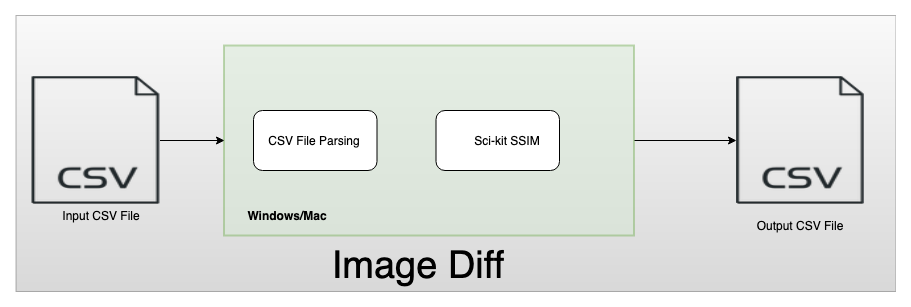

# Image-diff

Image Diff is a Python based utility which takes a csv file as an input containing absolute paths of the images to be matched against each other and produces the output in the csv format.

## Implementation
 image Diff uses **Structural Similarity Measure algorigthm** to detect the similarity between two images and produces output as 0 if they are perfect match. **Scikit-image** has built-in implementation of this algorithm which provides a convenient method to use :  **skimage.metrics.structural_similarity** 

## Architecture Diagram:



## How to run Image Diff

To run Image Diff, there are several pre-requisites:

## Pre-Requisites:
To use this utility, you should have these set of tools installed:

1. Python 3.7 or above.
2. Pip

### Python 3.7 Installation
Python can be installed from here:
* Mac : https://www.python.org/downloads/mac-osx/
* Windows: https://pip.pypa.io/en/stable/installing/

### Pip Installation 
Pip is a package manager for Python packages and can be installed by following the below steps:
1. Download File [get-pip.py](https://bootstrap.pypa.io/get-pip.py)
2. Once downloaded, run 
  ```python
  python get-pip.py
  ```
 
## Using Image Diff

Once you have **Python 3.7** and **Pip** installed, follow the below steps:

1. Clone this repo by running:
   ```
   git clone git@github.com:shardulsrivastava/image-diff.git
   ```
   Note: git command line can be installed by following the steps [here](https://git-scm.com/book/en/v2/Getting-Started-Installing-Git).
 
2. Open the terminal/cmd and go the the directory where the repo was cloned.
3. To run image Diff and give the input file run:
  ```
  ./bin/image_diff --input-file <YOUR INPUT CSV FILE PATH>
  ```
 
Note: To make sure you are running the latest code, please pull the latest code from repo by using command:
```
git pull
```
 
 
 ## Configuration Options
 
 Image Diff has two configuration options:
 * --input-file :  This allows you to give the input CSV path.
 * --output-file : By default, **Image Diff** generates the output in your `current working directory` with name `outut.csv`. We can also give the full path of the output file by using config option `--output-file`. An example would be:
```
  ./bin/image_diff --input-file <YOUR INPUT CSV FILE PATH> --output-file <YOUR OUTPUT CSV FILE PATH>
```

## Considerations:

### How do you know if your code works?
This repo has Github actions configured which run tests against Windows and Mac OS to check if the applications works on both platforms.

### How to get the latest version of the code
Before running the utility, please run command `git pull` to make you have the latest code.
  
 ## Tests
  
To make sure that this utility works fine, i have setup github actions workflow to run tests on **Windows and Mac OSX**.
Build is triggered on every push to the repo and tests run everytime to make sure that this utility works on both       environments.
  
  
